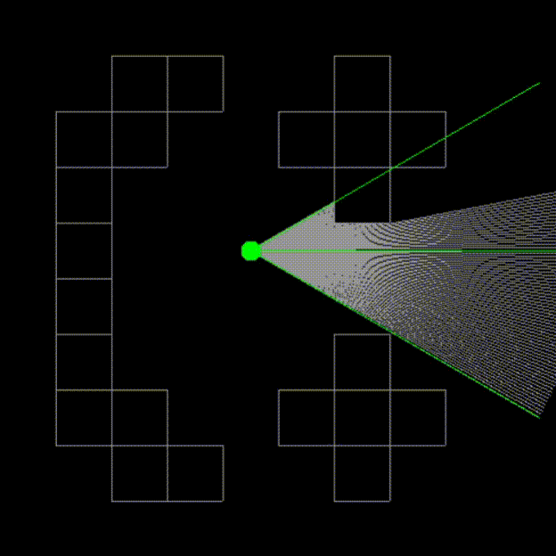

# Ray Casting 2D
Simple 2D ray casting algorithm using clear C++.



## Map input ##
Use following symbols to create different variations of maps in **map.txt** file.
* [ . ] - Walk space
* [ \# ] - Boreder position
* [ p ] - Player position

## Map example ##
```
.........
..##..#..
.##..###.
.#....#..
.#..p....
.#.......
.#....#..
.##..###.
..##..#..
.........
```